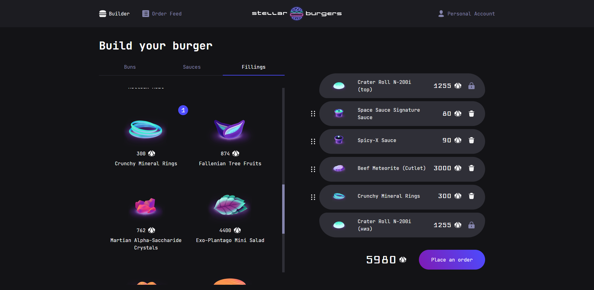

# Stellar Burgers Project



## Description

This desktop application is a website where **every registered user can create their own burger** from the provided ingredients (buns, sauces, and fillings) and place an order. The project includes a **user's personal account** with registration, login, and password reset functionalities.

**The personal account provides the following features:**

- Editing personal information
- Viewing order history
- Logging out of the account
- Detailed view of each order in a modal window (also accessible by entering the URL in the address bar)

The website header includes an **Order Feed** where any user can see **the latest** 50 **orders in real-time,** along with their **statuses** and the **total number of completed orders for today and all time.**

On the homepage, users can view **the available ingredients.** To build a burger, they need **to drag and drop** the desired ingredients to the right side of the screen. After **adding** all the necessary ingredients, users can **remove** them (except for the bun, which can only be replaced with another bun) and **change their order** in the burger.

## Stack
JavaScript, CSS, JSX, React, Redux, React Router, WebSocket, TypeScript.

# Project Setup
Node.js must be installed. Then, execute the following commands

```sh
npm i
```

```sh
npm start
```